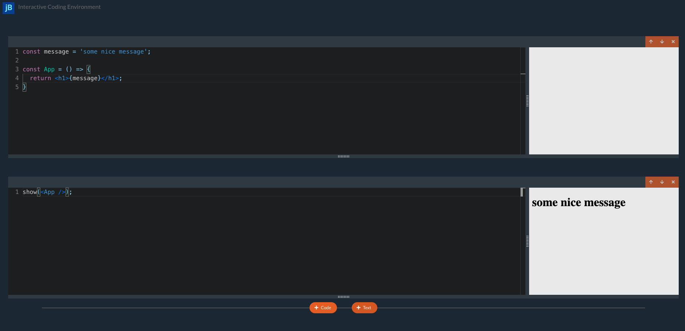

# jBook

# Requirements

[NodeJs](https://nodejs.org/en/)
[npx](https://www.npmjs.com/package/npx) or
[npm](https://www.npmjs.com/package/npm) (normally comes with Node.js)
or
[yarn](https://classic.yarnpkg.com/lang/en/docs/install/#mac-stable)

This is an interactive coding environment. You can write Javascript, import any NPM modules and see it executed, and write comprehensive documentation using markdown.

- Click any text cell (including this one) to edit it

- The code in each code editor is all joined together into one file. If you define a variable in cell#1, you can refer it to any following cells!

- You can show any React component, string, number or anything else by calling show function. This is a function built into this environment. Call show multiple times to show multiple values.

- Re-order or delete cells using the buttons on the top right

- Add new cells by hovering on the divider between cells

All of your changes get saved to the file you opened **jBook** with. So if your run **npx jsnote-ek serve test.js**, all of the text and code you write will be saved to the **test.js** that located in the same directory where you run command.

# Run

```
npx jsnote-ek serve

npx jsnote-ek serve [filename/path-to-file] [--port=<number>]
```


# Install

```
npm install [-g] jsnote-ek@latest
```

# Usage

```
jsnote-ek serve [filename/path-to-file] [--port=<number>]
```

Examples:

```
jsnote-ek serve test.js --port=3000

jsnote-ek serve -p 3000 test.js
```

Default filename is **notebook.js**, default port is **4005**


